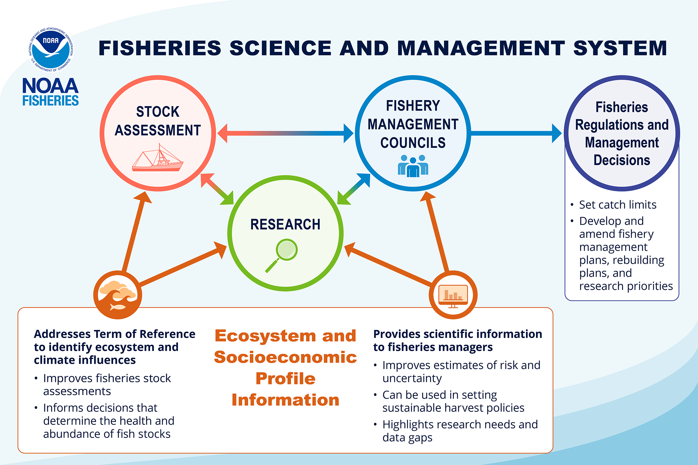

## Science and Management Applications

ESPs feed into the science and management process both qualitatively and quantitatively.

## Explore by Region

ESPs have been implemented in 3 regions thus far. Use the links below to explore region-specific ESP efforts:

### 🐟 Alaska

-   [Feature Story](https://www.fisheries.noaa.gov/feature-story/integrating-ecosystem-and-socioeconomic-information-fisheries-management)
-   [AK ESP Website](https://apex.psmfc.org/akfin/r/akfin/esp-web/home?session=7103974617561)
-   [Explore By Species](https://apex.psmfc.org/akfin/r/akfin/esp-web/stocks?session=7103974617561)

### 🦀 New England / Mid-Atlantic

-   [ESPs Overview Website](https://www.fisheries.noaa.gov/new-england-mid-atlantic/science-data/ecosystem-and-socioeconomic-profiles-northeast-united-states)
-   [Explore By Species](https://www.fisheries.noaa.gov/new-england-mid-atlantic/ecosystems/ecosystem-and-socioeconomic-profile-development-and-reports)

### 🐠 Pacific Islands

-   [Uku ESP Report](https://www.fisheries.noaa.gov/)
